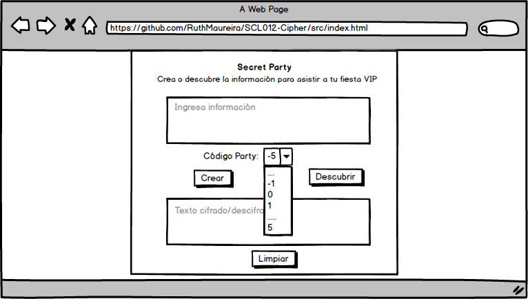
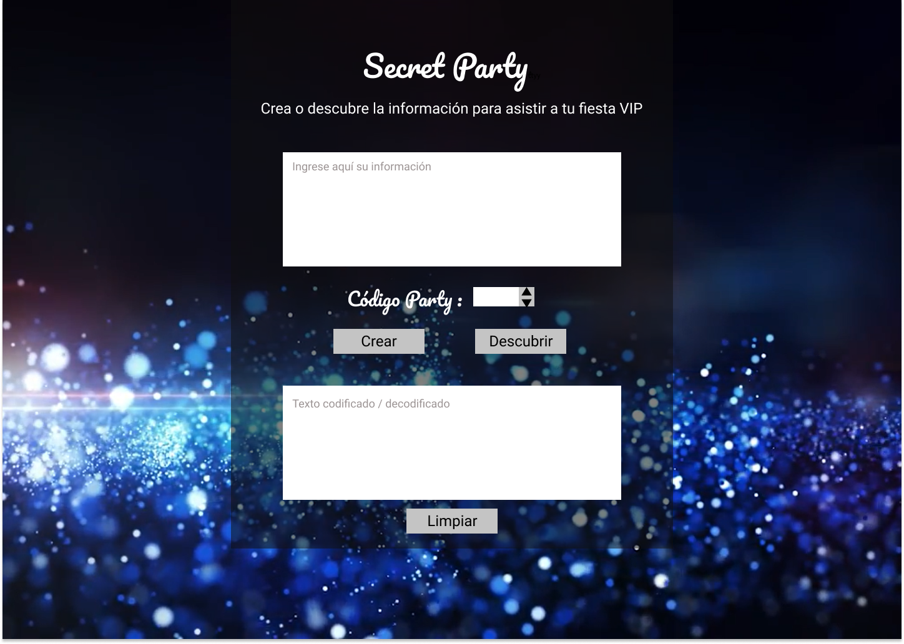
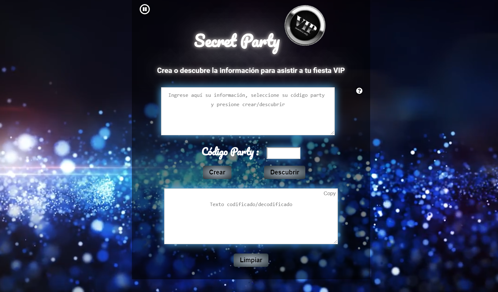
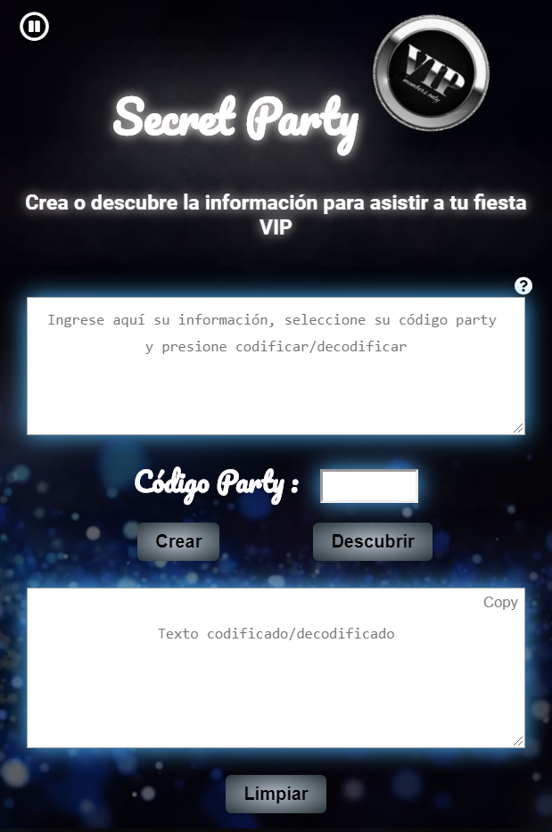

# Secret Party VIP

## Contexto 🌆

Actualmente como sociedad nos encontramos en un contexto de potente desarrollo de diversas tecnologías, como por ejemplo computadoras y teléfonos inteligentes, que nos han permitido diversificar nuestro alcance a comunicarnos de manera más fácil, rápida y fluida,  lo que además se ha visto impactado por el masificado uso de redes sociales que facilitan el contacto con nuestros seres queridos cercanos y no tan cercanos, abriendo así la oportunidad de establecer nuevas redes de contacto.   

**Secret Party VIP** 🎊

**Secret Party Vip** nace desde la necesidad actual de encontrar espacios digitales donde podamos desconectarnos de la rutina, creando áreas para compartir, conocer personas y concretamente conectar de manera rápida y segura con personas que, independiente de su edad y género, se encuentren interesadas en organizar o asistir a eventos exclusivos, compartiendo información clave como coordenadas del evento tal como fecha, hora, lugar de la fiesta así como mensajes adicionales que permitan desarrollar la fiesta exitosamente.
Está pensado en que los eventos sean con un caracter VIP, reservando de este modo el derecho de admisión, dando acceso sólo al(la) anfitrión(a) y los(las) invitados(as) a datos relevantes, por lo cual buscamos apelar a mantener la exclusividad de asistentes.

## Desarrollado para

[Laboratoria](http://laboratoria.la)

## Tecnología/lenguaje utilizado

* HTML5
* CSS3
* Javascript ES6

## Prototipado

El diseño de la aplicación cuenta con un fondo oscuro que recuerda la noche, el cual en conjunto con gliters provocan la sensación de un ambiente de fiesta. Ciertamente su combinación genera elegancia y el azul que acompaña al negro se escogió por ser un color que transmite seguridad, solidez, templanza.

### Prototipo baja fidelidad

### Prototipo alta fidelidad

## Vistas

### versión desktop

### versión mobile

## Intrucciónes de uso

### Para **Crear**:

1. ingresar información de su evento.

2. Elegir código party entre -100 y 100.

3. Presionar botón "Crear".

4. Recibirá su información codificada en recuadro inferior. Cópielo! (presione botón copy en esquina superior derecha del recuadro).

5. Presione botón "Limpiar" si desea volver a utilizar.

### Para **Descubrir**:

1. ingresar información de invitación.

2. Seleccionar código party entregado en invitación.

3. Presionar botón "Descubrir".

4. Recibirá su información decodificada en recuadro inferior. Cópielo! (presione botón copy en esquina superior derecha del recuadro).

5. Presione botón "Limpiar" si desea volver a utilizar.

## Enlace Deploy

[**Secret Party VIP**](https://ruthmaureira.github.io/SCL012-Cipher/src/index.html)
